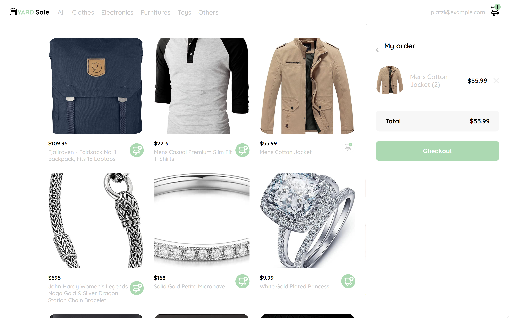

# React Shop


Es una simple SPA de una tienda ficticia, desarrollada con la librería React, esta basada en el curso práctico de React de platzi, en dicho curso al finalizar se dejan varios retos para solucionar distintos bugs que se encuentran en la aplicación.

Utiliza una API pública llamada FakeStore a través de la cual se obtienen productos.

## Proyecto
[Desplegar](https://trusting-ritchie-8470b9.netlify.app/) 🚀

## Recursos y Enlaces
- [Diseño movil en Figma](https://www.figma.com/proto/bcEVujIzJj5PNIWwF9pP2w/Platzi_YardSale?node-id=0%3A719&amp%3Bscaling=scale-down&amp%3Bpage-id=0%3A1&amp%3Bstarting-point-node-id=0%3A719)
- [Diseño para Desktop](https://www.figma.com/proto/bcEVujIzJj5PNIWwF9pP2w/Platzi_YardSale?node-id=5%3A2808&amp%3Bpage-id=0%3A998&amp%3Bstarting-point-node-id=5%3A2808)
- [Fakestore API](https://fakestoreapi.com/)

## Tecnologías Utilizadas
- [React](https://es.reactjs.org/)
- [Sass](https://sass-lang.com/)
- [Webpack](https://webpack.js.org/)
- [Babel](https://babeljs.io/)

## Instalación
Clonar el repositorio:

```
git clone https://github.com/JMauricio22/react-simple-store
```
Instalar dependencias:
```
npm install
```
Ejecutar la Aplicación:
```
npm start
```

## Contacto

- GitHub [@JMauricio22](https://github.com/JMauricio22)